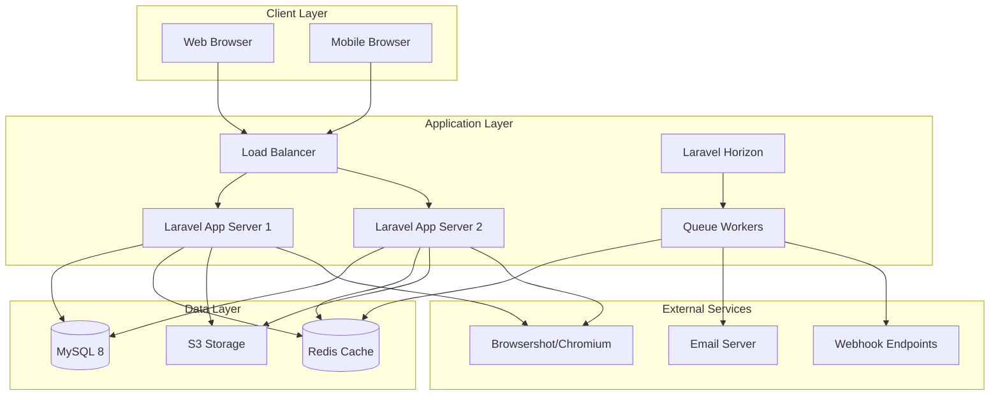

# PLANNING.md - Sales Quotation & Invoicing System

## 🎯 Vision & Mission

### Vision Statement
To become Bina Group's single source of truth for sales operations, delivering a beautifully designed, intuitive platform that transforms how teams manage customer relationships, create quotations, and track payments—setting a new standard for internal business tools.

### Mission
Build a minimalist, high-performance web application that:
- Centralizes 100% of sales operations in one elegant interface
- Reduces quote generation time by 50% through smart templates
- Provides real-time visibility across all organizational levels
- Maintains data integrity with zero security compromises
- Delivers a consumer-grade user experience for enterprise needs

### Core Values
1. **Simplicity First**: Every feature must justify its complexity
2. **Performance Matters**: Sub-second responses are the standard
3. **Beautiful by Default**: Professional aesthetics without customization
4. **Data Integrity**: Every transaction is audited and recoverable
5. **User Empowerment**: Intuitive interfaces that require minimal training

---

## 🏗️ System Architecture

### High-Level Architecture



### Application Architecture Pattern

```
├── Presentation Layer (MVC)
│   ├── Controllers (HTTP handling)
│   ├── Middleware (Auth, RBAC, Tenancy)
│   ├── Form Requests (Validation)
│   └── Resources (API transformation)
│
├── Business Logic Layer
│   ├── Services (Complex operations)
│   ├── Actions (Single responsibility)
│   ├── Events (System notifications)
│   └── Listeners (Event handlers)
│
├── Data Access Layer
│   ├── Models (Eloquent ORM)
│   ├── Repositories (Complex queries)
│   ├── Scopes (Query constraints)
│   └── Observers (Model events)
│
└── Infrastructure Layer
    ├── Queue Jobs (Async processing)
    ├── Console Commands (CLI operations)
    ├── Providers (Service registration)
    └── External Services (APIs, Storage)
```

### Multi-Tenancy Architecture

```php
// Single Database, Shared Schema with Row-Level Isolation
companies
    ↓ company_id (tenant identifier)
    ├── users
    ├── teams  
    ├── leads
    ├── quotations
    ├── invoices
    └── [all tenant data]

// Global Scope Applied Automatically
Model::addGlobalScope('company', function ($query) {
    $query->where('company_id', auth()->user()->company_id);
});
```

### Security Architecture

```yaml
Layers:
  1. Network:
     - SSL/TLS encryption (Let's Encrypt)
     - WAF (Web Application Firewall)
     - DDoS protection (Cloudflare)
  
  2. Application:
     - CSRF protection
     - XSS prevention
     - SQL injection prevention (Eloquent ORM)
     - Rate limiting
     - Session management
  
  3. Authentication:
     - Laravel Sanctum/Breeze
     - 2FA support (TOTP)
     - Password policies
     - Session timeout
  
  4. Authorization:
     - RBAC (Role-Based Access Control)
     - Resource policies
     - Scope-based queries
     - Signed URLs for sensitive resources
  
  5. Data:
     - Encryption at rest
     - Encryption in transit
     - Audit logging
     - Soft deletes with recovery
```

---

## 💻 Technology Stack

### Core Technologies

| Layer | Technology | Version | Purpose |
|-------|------------|---------|---------|
| **Language** | PHP | 8.3+ | Primary backend language |
| **Framework** | Laravel | 11.x | Full-stack web framework |
| **Database** | MySQL | 8.0+ | Primary data store |
| **Cache** | Redis | 7.0+ | Session, cache, queues |
| **Queue** | Laravel Horizon | 5.x | Queue monitoring & management |
| **Search** | Laravel Scout | 10.x | Full-text search (optional) |

### Frontend Stack

| Technology | Version | Purpose |
|------------|---------|---------|
| **Blade** | Laravel 11 | Template engine |
| **Alpine.js** | 3.x | Reactive components |
| **Tailwind CSS** | 3.4+ | Utility-first CSS |
| **Livewire** | 3.x | Dynamic components (optional) |
| **Vite** | 5.x | Asset bundling |
| **Chart.js** | 4.x | Analytics charts |

### PDF Generation Stack

| Technology | Version | Purpose |
|------------|---------|---------|
| **Browsershot** | 3.x | HTML to PDF conversion |
| **Puppeteer** | Latest | Headless Chrome control |
| **Chromium** | Latest | PDF rendering engine |
| **DomPDF** | 2.x | Backup PDF generator |

### Development Stack

| Tool | Version | Purpose |
|------|---------|---------|
| **Pest PHP** | 2.x | Testing framework |
| **Laravel Debugbar** | 3.x | Debug toolbar |
| **Laravel Telescope** | 5.x | Debug assistant |
| **PHPStan** | 1.x | Static analysis |
| **Laravel Pint** | 1.x | Code formatting |
| **Git** | Latest | Version control |

### Infrastructure Stack

| Service | Provider | Purpose |
|---------|----------|---------|
| **Hosting** | AWS EC2 / DigitalOcean | Application servers |
| **Database** | AWS RDS / Managed MySQL | Database hosting |
| **Cache** | AWS ElastiCache / Redis Labs | Managed Redis |
| **Storage** | AWS S3 / DigitalOcean Spaces | File storage |
| **CDN** | CloudFlare / AWS CloudFront | Asset delivery |
| **Monitoring** | Sentry / Rollbar | Error tracking |
| **Analytics** | Plausible / Matomo | Usage analytics |
| **CI/CD** | GitHub Actions / GitLab CI | Automated deployment |

---

## 🛠️ Required Tools & Setup

### Development Environment

#### 1. **Operating System**
```bash
# Recommended
- macOS (latest)
- Ubuntu 22.04 LTS
- Windows 11 with WSL2

# Minimum Requirements
- 8GB RAM (16GB recommended)
- 20GB free disk space
- 64-bit processor
```

#### 2. **PHP Installation**
```bash
# macOS (using Homebrew)
brew install php@8.3
brew install composer

# Ubuntu/Debian
sudo apt update
sudo apt install php8.3 php8.3-{cli,common,mysql,zip,gd,mbstring,curl,xml,bcmath}
sudo apt install composer

# Extensions Required
- BCMath
- Ctype
- Fileinfo
- JSON
- Mbstring
- OpenSSL
- PDO & PDO_MySQL
- Tokenizer
- XML
- cURL
- GD or ImageMagick
- Redis
```

#### 3. **Node.js & NPM**
```bash
# Install via NVM (recommended)
curl -o- https://raw.githubusercontent.com/nvm-sh/nvm/v0.39.0/install.sh | bash
nvm install 20
nvm use 20

# Verify installation
node --version  # Should be 20.x
npm --version   # Should be 10.x
```

#### 4. **Database Setup**
```bash
# MySQL 8.0
# macOS
brew install mysql@8.0
brew services start mysql@8.0

# Ubuntu
sudo apt install mysql-server-8.0
sudo systemctl start mysql

# Create database
mysql -u root -p
CREATE DATABASE sales_system CHARACTER SET utf8mb4 COLLATE utf8mb4_unicode_ci;
CREATE USER 'sales_user'@'localhost' IDENTIFIED BY 'secure_password';
GRANT ALL PRIVILEGES ON sales_system.* TO 'sales_user'@'localhost';
FLUSH PRIVILEGES;
```

#### 5. **Redis Installation**
```bash
# macOS
brew install redis
brew services start redis

# Ubuntu
sudo apt install redis-server
sudo systemctl start redis

# Verify
redis-cli ping  # Should return PONG
```

#### 6. **PDF Generation Tools**
```bash
# Install Chromium for Browsershot
# macOS
brew install chromium

# Ubuntu
sudo apt install chromium-browser

# Install Puppeteer dependencies
npm install puppeteer

# Alternative: Install wkhtmltopdf (backup)
# macOS
brew install --cask wkhtmltopdf

# Ubuntu
sudo apt install wkhtmltopdf
```

### Development Tools

#### 1. **IDE / Code Editor**
```yaml
Recommended:
  - PhpStorm (Full IDE with Laravel support)
  - VS Code with extensions:
    - Laravel Extension Pack
    - PHP Intelephense
    - Tailwind CSS IntelliSense
    - Alpine.js IntelliSense
    - GitLens
    - Prettier
    - ESLint

Settings (VS Code):
  {
    "editor.fontSize": 14,
    "editor.lineHeight": 24,
    "editor.fontFamily": "Fira Code, monospace",
    "editor.fontLigatures": true,
    "editor.formatOnSave": true,
    "tailwindCSS.emmetCompletions": true
  }
```

#### 2. **Database Management**
```yaml
Options:
  - TablePlus (macOS/Windows/Linux)
  - phpMyAdmin (Web-based)
  - MySQL Workbench (Official)
  - DBeaver (Cross-platform)
  - Sequel Pro (macOS)
```

#### 3. **API Testing Tools**
```yaml
Options:
  - Postman (Full-featured)
  - Insomnia (Lightweight)
  - Thunder Client (VS Code extension)
  - HTTPie (CLI)
  
Collections to Create:
  - Authentication endpoints
  - Lead management
  - Quotation CRUD
  - Invoice operations
  - Reporting APIs
  - Webhook testing
```

#### 4. **Version Control**
```bash
# Git configuration
git config --global user.name "Your Name"
git config --global user.email "your.email@example.com"
git config --global init.defaultBranch main

# Git GUI clients (optional)
- GitHub Desktop
- Sourcetree
- GitKraken
- Tower
```

#### 5. **Docker Setup (Optional but Recommended)**
```yaml
# docker-compose.yml
version: '3.8'
services:
  app:
    image: php:8.3-fpm
    volumes:
      - .:/var/www
    networks:
      - sales-network
  
  nginx:
    image: nginx:alpine
    ports:
      - "80:80"
    volumes:
      - .:/var/www
      - ./docker/nginx:/etc/nginx/conf.d
    networks:
      - sales-network
  
  mysql:
    image: mysql:8.0
    environment:
      MYSQL_DATABASE: sales_system
      MYSQL_ROOT_PASSWORD: root
      MYSQL_PASSWORD: secret
      MYSQL_USER: sales_user
    ports:
      - "3306:3306"
    networks:
      - sales-network
  
  redis:
    image: redis:alpine
    ports:
      - "6379:6379"
    networks:
      - sales-network

networks:
  sales-network:
    driver: bridge
```

### Laravel Packages Required

```json
{
  "require": {
    "php": "^8.3",
    "laravel/framework": "^11.0",
    "laravel/breeze": "^2.0",
    "laravel/horizon": "^5.0",
    "laravel/sanctum": "^4.0",
    "spatie/laravel-permission": "^6.0",
    "spatie/browsershot": "^3.0",
    "spatie/laravel-pdf": "^1.0",
    "spatie/laravel-query-builder": "^5.0",
    "spatie/laravel-medialibrary": "^11.0",
    "spatie/laravel-activitylog": "^4.0",
    "spatie/laravel-backup": "^8.0",
    "maatwebsite/excel": "^3.1",
    "barryvdh/laravel-debugbar": "^3.0",
    "barryvdh/laravel-dompdf": "^2.0"
  },
  "require-dev": {
    "pestphp/pest": "^2.0",
    "pestphp/pest-plugin-laravel": "^2.0",
    "laravel/telescope": "^5.0",
    "laravel/pint": "^1.0",
    "nunomaduro/larastan": "^2.0",
    "fakerphp/faker": "^1.23"
  }
}
```

### NPM Packages Required

```json
{
  "devDependencies": {
    "@tailwindcss/forms": "^0.5.7",
    "@tailwindcss/typography": "^0.5.10",
    "alpinejs": "^3.13.5",
    "autoprefixer": "^10.4.17",
    "axios": "^1.6.7",
    "laravel-vite-plugin": "^1.0.1",
    "postcss": "^8.4.35",
    "tailwindcss": "^3.4.1",
    "vite": "^5.0.12"
  },
  "dependencies": {
    "chart.js": "^4.4.1",
    "dayjs": "^1.11.10",
    "tom-select": "^2.3.1",
    "sweetalert2": "^11.10.5",
    "tippy.js": "^6.3.7"
  }
}
```

---

## 📁 Project Structure

```
sales-system/
├── app/
│   ├── Actions/              # Single-purpose action classes
│   ├── Console/             # Artisan commands
│   ├── Events/              # Event classes
│   ├── Exceptions/          # Exception handlers
│   ├── Http/
│   │   ├── Controllers/     # HTTP controllers
│   │   ├── Middleware/      # Custom middleware
│   │   └── Requests/        # Form requests
│   ├── Jobs/                # Queue jobs
│   ├── Listeners/           # Event listeners
│   ├── Mail/                # Mailable classes
│   ├── Models/              # Eloquent models
│   ├── Observers/           # Model observers
│   ├── Policies/            # Authorization policies
│   ├── Providers/           # Service providers
│   ├── Rules/               # Validation rules
│   └── Services/            # Business logic services
├── bootstrap/               # Framework bootstrap
├── config/                  # Configuration files
├── database/
│   ├── factories/           # Model factories
│   ├── migrations/          # Database migrations
│   └── seeders/             # Database seeders
├── docker/                  # Docker configuration
├── docs/                    # Documentation
│   ├── PRD.md
│   ├── PLANNING.md
│   ├── claude.md
│   └── API.md
├── public/                  # Public assets
├── resources/
│   ├── css/                 # Stylesheets
│   ├── js/                  # JavaScript
│   └── views/               # Blade templates
│       ├── components/      # Reusable components
│       ├── layouts/         # Layout templates
│       ├── pdf/             # PDF templates
│       └── pages/           # Page templates
├── routes/
│   ├── api.php              # API routes
│   ├── web.php              # Web routes
│   └── console.php          # Console routes
├── storage/                 # Storage directory
├── tests/
│   ├── Feature/             # Feature tests
│   ├── Unit/                # Unit tests
│   └── Pest.php             # Pest configuration
├── .env.example             # Environment example
├── .gitignore               # Git ignore rules
├── artisan                  # Artisan CLI
├── composer.json            # PHP dependencies
├── package.json             # Node dependencies
├── phpstan.neon             # PHPStan config
├── phpunit.xml              # PHPUnit config
├── tailwind.config.js       # Tailwind config
└── vite.config.js           # Vite config
```

---

## 🚀 Development Workflow

### Initial Setup

```bash
# 1. Clone repository
git clone https://github.com/binagroup/sales-system.git
cd sales-system

# 2. Install PHP dependencies
composer install

# 3. Install Node dependencies
npm install

# 4. Environment setup
cp .env.example .env
php artisan key:generate

# 5. Database setup
php artisan migrate --seed

# 6. Storage linking
php artisan storage:link

# 7. Start development servers
php artisan serve              # Laravel server
npm run dev                     # Vite dev server
php artisan queue:work          # Queue worker
php artisan horizon            # Horizon dashboard

# 8. Access application
# Web: http://localhost:8000
# Horizon: http://localhost:8000/horizon
```

### Development Commands

```bash
# Database
php artisan migrate:fresh --seed    # Reset database with seeders
php artisan db:seed --class=DemoSeeder  # Run specific seeder

# Code Quality
./vendor/bin/pint                   # Format code
./vendor/bin/phpstan analyse        # Static analysis
php artisan test                    # Run tests
php artisan test --parallel         # Run tests in parallel

# Cache Management
php artisan cache:clear             # Clear application cache
php artisan config:clear            # Clear config cache
php artisan route:clear             # Clear route cache
php artisan view:clear              # Clear view cache
php artisan optimize:clear          # Clear all caches

# Asset Building
npm run build                       # Production build
npm run dev                         # Development mode
npm run watch                       # Watch for changes

# Queue Management
php artisan queue:retry all         # Retry failed jobs
php artisan queue:flush             # Delete all failed jobs
php artisan horizon:snapshot        # Take metrics snapshot
```

---

## 📊 Performance Targets

### Response Time Goals

| Operation | Target | Maximum |
|-----------|--------|---------|
| Page Load | < 200ms | 500ms |
| API Response | < 100ms | 200ms |
| Search Query | < 300ms | 500ms |
| PDF Generation | < 2s | 3s |
| Report Export | < 5s | 10s |
| Dashboard Load | < 1s | 2s |

### Scalability Targets

| Metric | Target |
|--------|--------|
| Concurrent Users | 1,000+ |
| Daily Transactions | 100,000+ |
| Database Size | 100GB+ |
| Monthly Uptime | 99.9% |
| Peak Load | 100 req/sec |

### Optimization Strategies

```yaml
Database:
  - Proper indexing on foreign keys and search fields
  - Query optimization with EXPLAIN
  - Eager loading to prevent N+1
  - Database query caching
  - Read replicas for reporting

Application:
  - Route caching in production
  - Config caching in production
  - View caching for static content
  - API response caching
  - CDN for static assets

Frontend:
  - Lazy loading for images
  - Code splitting with Vite
  - Minification and compression
  - Browser caching headers
  - Progressive enhancement
```

---

## 🔒 Security Checklist

### Pre-Production Security Audit

- [ ] All user inputs validated and sanitized
- [ ] SQL injection prevention via prepared statements
- [ ] XSS prevention with proper escaping
- [ ] CSRF tokens on all forms
- [ ] Rate limiting on all endpoints
- [ ] Secure session configuration
- [ ] HTTPS enforced in production
- [ ] Security headers configured
- [ ] File upload restrictions
- [ ] API authentication required
- [ ] Permissions checked at all levels
- [ ] Sensitive data encrypted
- [ ] Audit logging enabled
- [ ] Error messages don't leak information
- [ ] Dependencies updated and scanned

---

## 📈 Monitoring & Observability

### Application Monitoring

```yaml
Metrics to Track:
  - Response time (p50, p95, p99)
  - Error rate
  - Queue length and processing time
  - Database query performance
  - Memory usage
  - CPU utilization
  - Active user sessions
  - PDF generation success rate
  - Webhook delivery rate

Tools:
  - Laravel Telescope (Development)
  - Laravel Horizon (Queues)
  - Sentry/Rollbar (Errors)
  - New Relic/DataDog (APM)
  - CloudWatch/Grafana (Infrastructure)
  - Plausible/Matomo (Analytics)
```

### Logging Strategy

```php
// Structured logging
Log::channel('sales')->info('Quotation created', [
    'quotation_id' => $quotation->id,
    'user_id' => auth()->id(),
    'total' => $quotation->total,
    'items_count' => $quotation->items->count(),
]);

// Log Levels
- DEBUG: Detailed debugging information
- INFO: Interesting events (user logs in)
- NOTICE: Normal but significant events
- WARNING: Exceptional occurrences
- ERROR: Runtime errors
- CRITICAL: Critical conditions
- ALERT: Action must be taken immediately
- EMERGENCY: System is unusable
```

---

## 🎓 Training & Documentation

### Documentation Requirements

1. **User Documentation**
   - Getting started guide
   - Role-specific tutorials
   - Video walkthroughs
   - FAQ section

2. **Technical Documentation**
   - API documentation (OpenAPI/Swagger)
   - Database schema
   - Deployment guide
   - Troubleshooting guide

3. **Business Documentation**
   - Process flows
   - Business rules
   - Report descriptions
   - Integration guides

### Training Plan

```yaml
Week 1: System Administrators
  - System setup and configuration
  - User management
  - Backup and recovery
  - Monitoring and maintenance

Week 2: Management Users
  - Dashboard navigation
  - Report generation
  - Team management
  - Performance monitoring

Week 3: Sales Teams
  - Lead management
  - Quotation creation
  - Template usage
  - Invoice tracking

Week 4: Finance Team
  - Pricing management
  - Invoice status updates
  - Financial reporting
  - Audit trails
```

---

## ✅ Launch Checklist

### Pre-Launch (2 weeks before)
- [ ] All features tested and signed off
- [ ] Performance testing completed
- [ ] Security audit passed
- [ ] Documentation completed
- [ ] Training materials prepared
- [ ] Backup strategy tested
- [ ] Monitoring configured
- [ ] SSL certificates installed

### Launch Day
- [ ] Database backed up
- [ ] Maintenance mode enabled
- [ ] Production deployment
- [ ] DNS updated
- [ ] SSL verified
- [ ] Smoke tests passed
- [ ] Monitoring active
- [ ] Support team ready

### Post-Launch (1 week after)
- [ ] Performance metrics reviewed
- [ ] Error logs analyzed
- [ ] User feedback collected
- [ ] Bug fixes prioritized
- [ ] Training sessions completed
- [ ] Documentation updated
- [ ] Success metrics evaluated
- [ ] Optimization opportunities identified

---

## 📝 Notes

This planning document is a living document and should be updated as the project evolves. Regular reviews should be conducted to ensure alignment with business objectives and technical requirements.

**Last Updated**: August 30, 2025  
**Version**: 1.0  
**Status**: Active Development